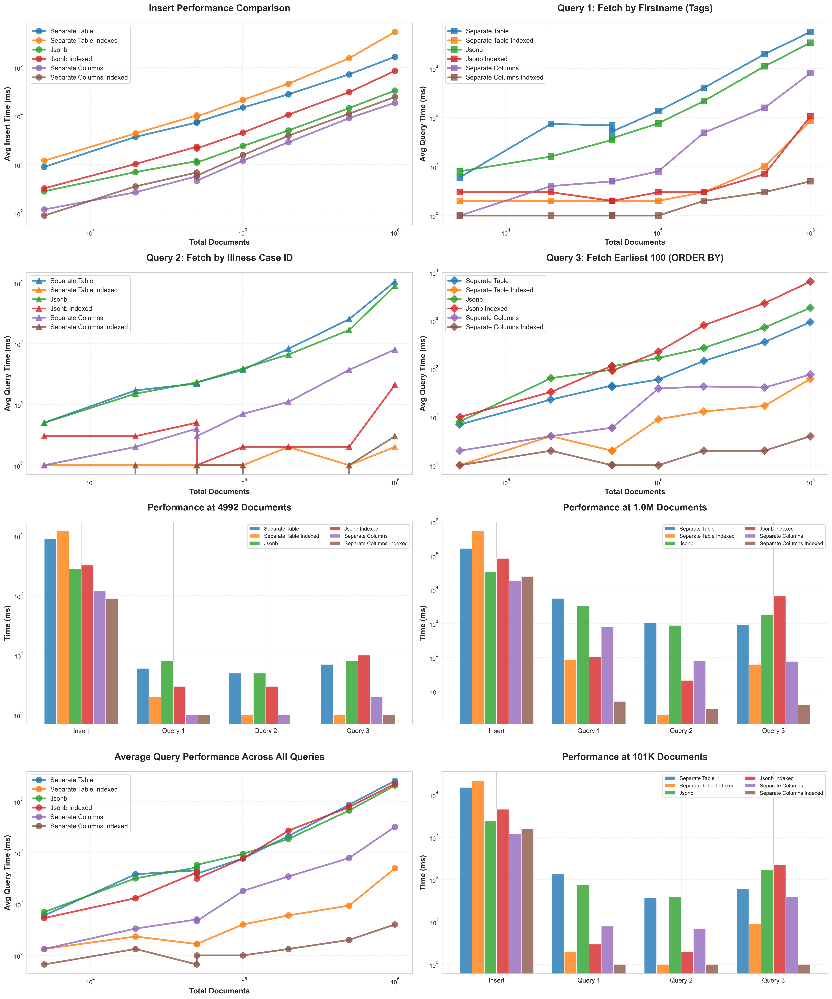

# Database Design Benchmark Analysis

## Overview

This benchmark compares four different PostgreSQL data modeling approaches for storing illness case documents with varying scales of data.

## Test Configuration

Benchmark is running through Bun on **Postgres 18**.

### Data Models Tested

1. **separate_table** - `documents` table + `document_tags` table with `id` (primary key), `document_id` (foreign key), `key` (text), `value` (text)
2. **separate_table_indexed** - Same setup but with index on `key`, `value` and `key,value`
3. **jsonb** - `documents` table with `tags` column (JSONB) with structure `{ key: string, value: string }[]`
4. **jsonb_indexed** - Same setup but with GIN index

### Scale Parameters

- **Illness Cases**: 1,000 | 10,000 | 100,000
- **Documents Per Case**: 5 | 20 | 50 | 100
- **Total Documents**: Ranges from ~5K to ~5M documents

### Queries Benchmarked

1. **Query 1**: Fetch all documents where key `firstname` has a value of *random firstname from the dataset*
2. **Query 2**: Fetch all documents where key `illness_case_id` has a value of *random illness_case_id from the dataset*
3. **Query 3**: Fetch 100 documents ordered the value inside a tag with key `published_at`

## Performance at Maximum Scale

_(100,000 cases × 50 documents = ~5M documents)_

| Model                      | Insert (s) | Q1 (ms) | Q2 (ms) | Q3 (ms) |
| -------------------------- | ---------- | ------- | ------- | ------- |
| Separate Table             | 251        | 11,665  | 1,255   | 3,738   |
| **Separate Table + Index** | **982**    | **140** | **4**   | **48**  |
| JSONB                      | 108        | 9,634   | 734     | 4,027   |
| JSONB + Index              | 229        | 585     | 105     | 14,956  |

## Visualization

